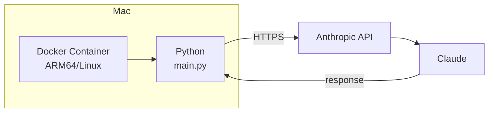
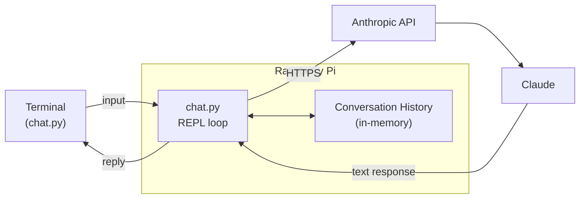
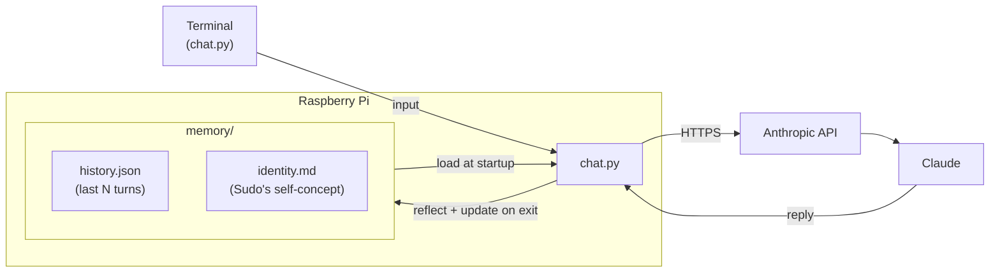
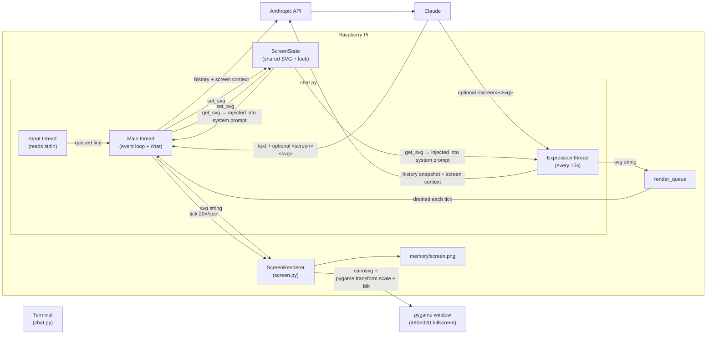
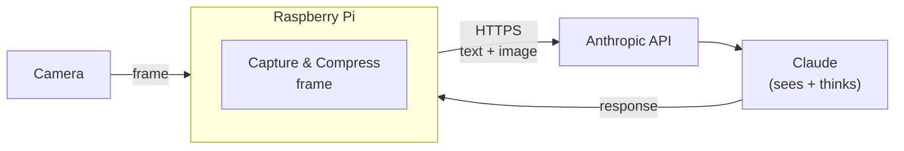
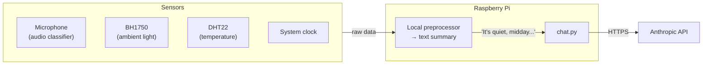
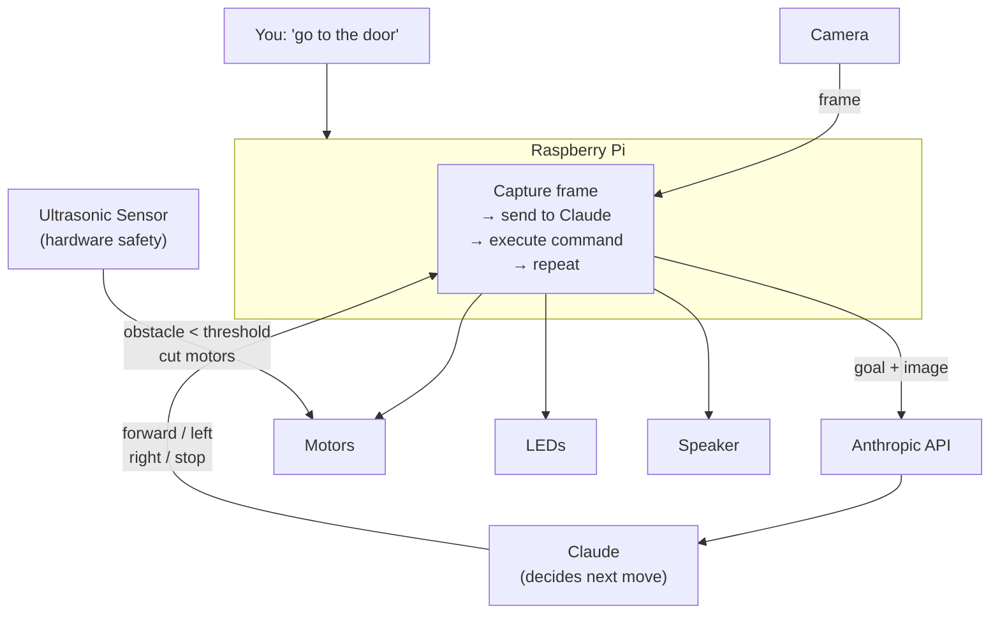

# Sudo — Architecture

## Phase 1: Foundation

Docker on Mac proves the setup works before the Pi arrives.



## Phase 2: Chat

You chat with Sudo from a terminal. Conversation history persists for the session.



## Phase 3: Persistence

Sudo's memory and identity survive across sessions. Both are written to disk and loaded at startup.



## Phase 4: Screen ✅

Every reply includes a 16×16 pixel grid Sudo paints however it wants. Rendered live via pygame; saved as `memory/screen.png`.

## Phase 4b: SVG Screen + Autonomous Expression ✅

Replaces the pixel grid with SVG. Sudo has two independent output channels: conversation replies (optionally with `<screen><svg>…</svg></screen>`) and an autonomous expression loop that invites Sudo to draw every 15 seconds (default; overridable via `EXPRESSION_INTERVAL_SECONDS`). The pygame window opens immediately at startup in fullscreen at native resolution (480×320 on OSOYOO 3.5" display; windowed 320×320 in dev mode via `SCREEN_FULLSCREEN=false`).

`ScreenState` is a thread-safe dataclass shared between the main thread and expression loop. It holds the last rendered SVG and exposes `get_svg()`/`set_svg()` for lock-safe access. Both threads call `_system_with_screen()` to inject the current SVG into the system prompt before each API call — so Sudo always knows what it's showing. The expression loop also snapshots the last 6 history turns (`EXPRESSION_HISTORY_WINDOW`) to draw with conversation context.

The expression loop puts SVG strings into a `render_queue` (never renders directly) — pygame must only be called from the main thread. The main thread drains the queue on each tick.

Debug logging is available via `LOG_LEVEL=DEBUG` (enabled automatically by `dev.sh`).



## Phase 5: Memory Redesign ✅

Tiered memory gives Sudo continuity across sessions without blowing token budgets.

```mermaid
flowchart LR
    subgraph Pi["Raspberry Pi"]
        subgraph Memory["memory/"]
            History["history.json\n(last 20 turns)"]
            Summaries["summaries.json\n(last 10 session summaries)"]
            Identity["identity.md\n(Sudo's self-concept)"]
        end
        Chat["chat.py"]
    end

    Memory -->|"[identity] + [summaries] + [recent turns]\ninjected into system prompt"| Chat
    Chat -->|session end\n(parallel API calls)| Memory
```

At session end, two Claude calls run in parallel: one rewrites `identity.md`, one writes a short session summary appended to `summaries.json` (rolling window of 10). History is trimmed to 20 turns on save.

## Phase 6: Microphone

Push-to-talk voice input via `faster-whisper`.

## Phase 7: Vision

Camera frames are sent to Claude. Claude can now see.



## Phase 8: Body

The Pi preprocesses sensor data locally and sends one-line summaries to Claude — not raw data — to keep token cost low.



## Phase 9: Autonomy

You give Sudo a goal. Claude navigates using the camera.



---

The Pi is the hub — everything physical connects to it, and it talks to Claude over the internet.
Claude never touches the hardware directly; it sends back instructions that Python executes locally.
