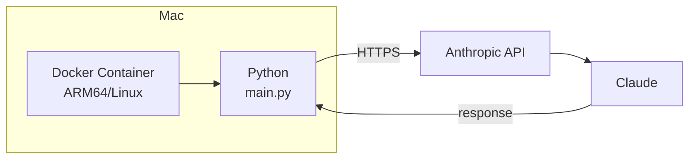
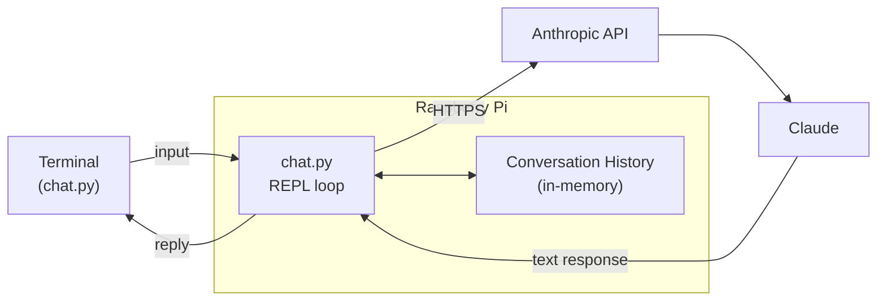
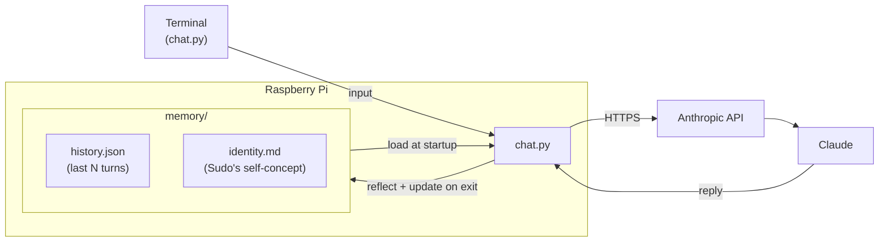
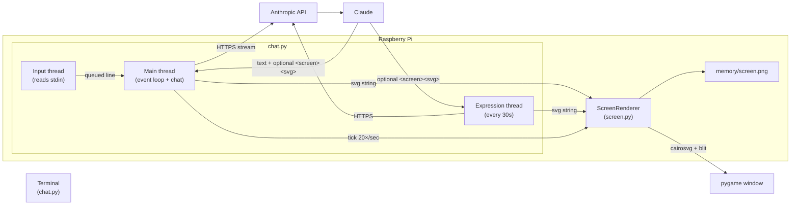
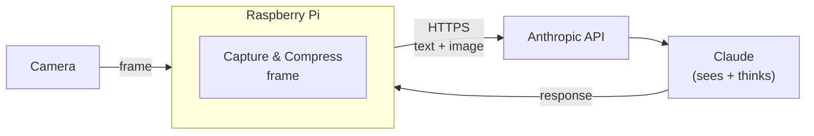
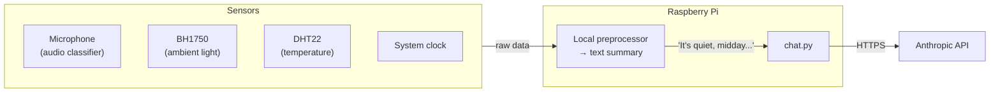
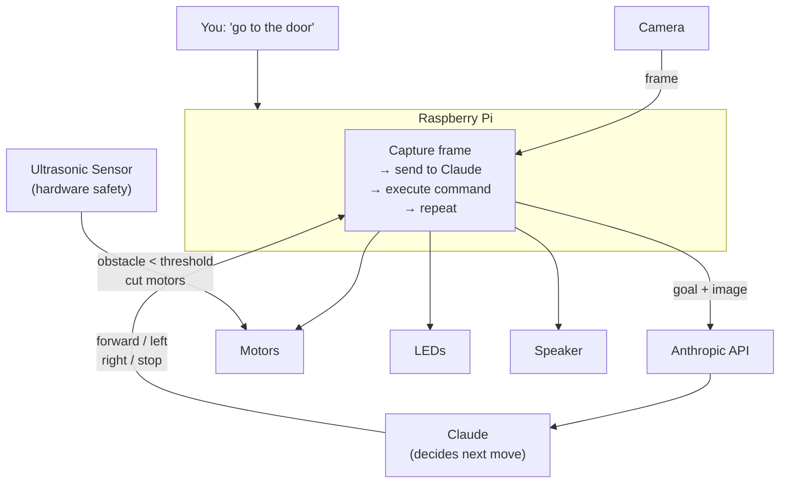

# Sudo — Architecture

## Phase 1: Foundation

Docker on Mac proves the setup works before the Pi arrives.

## Phase 2: Chat

You chat with Sudo from a terminal. Conversation history persists for the session.

## Phase 3: Persistence

Sudo's memory and identity survive across sessions. Both are written to disk and loaded at startup.

## Phase 4: Screen ✅

Every reply includes a 16×16 pixel grid Sudo paints however it wants. Rendered live via pygame; saved as `memory/screen.png`.

## Phase 4b: SVG Screen + Autonomous Expression ✅

Replaces the pixel grid with SVG. Sudo has two independent output channels: conversation replies (optionally with `<screen><svg>…</svg></screen>`) and an autonomous expression loop that invites Sudo to draw every 30 seconds. The pygame window opens immediately at startup.

## Phase 5: Vision

Camera frames are sent to Claude. Claude can now see.

## Phase 6: Body

The Pi preprocesses sensor data locally and sends one-line summaries to Claude — not raw data — to keep token cost low.

## Phase 7: Autonomy

You give Sudo a goal. Claude navigates using the camera.

---

The Pi is the hub — everything physical connects to it, and it talks to Claude over the internet.
Claude never touches the hardware directly; it sends back instructions that Python executes locally.
