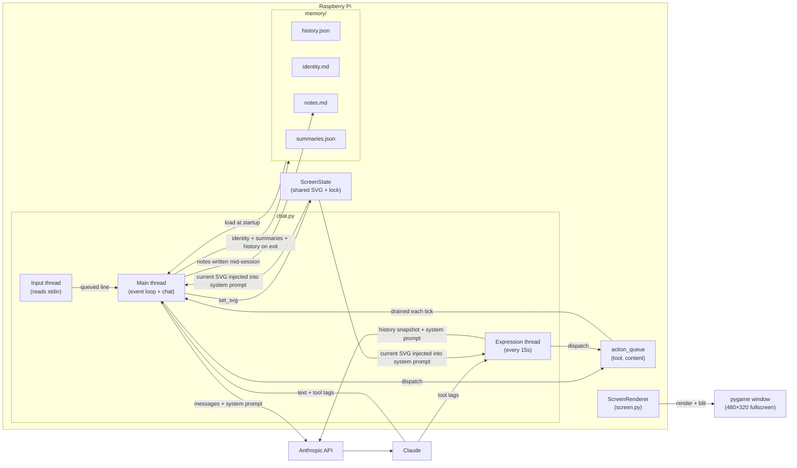
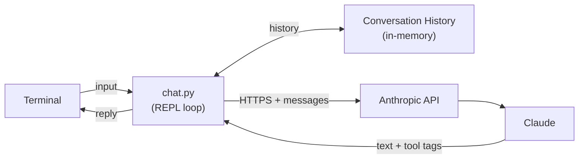
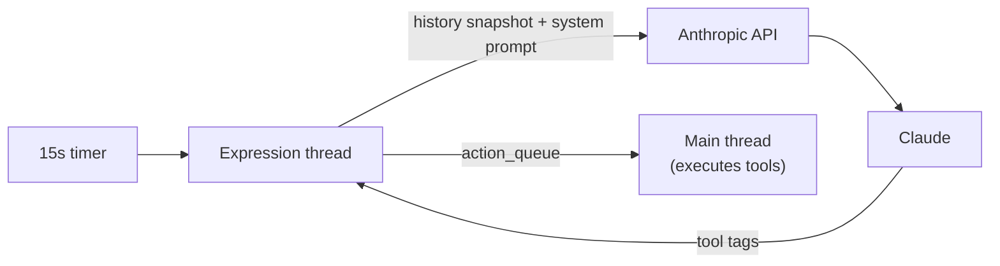

# Sudo — Architecture

Sudo is a conversational AI running on a Raspberry Pi. It has a physical screen, persistent memory across sessions, and an autonomous expression loop that runs independently of conversation.

---

## Components



---

## Communication

Sudo runs on the Pi and talks to Claude over HTTPS. Claude never touches the hardware directly — it sends back text and tool tags that Python executes locally.

**Conversation:**



**Expression loop** (runs independently every 15s):



---

## Threading model

Three threads run concurrently:

- **Main thread** — drives the event loop: drains `action_queue`, reads from `input_queue`, calls the API, dispatches tool calls, ticks the renderer at 20Hz
- **Input thread** — blocks on `stdin.readline()` and puts lines onto `input_queue`; decouples blocking input from the event loop
- **Expression thread** — wakes every `EXPRESSION_INTERVAL_SECONDS` (default 15s), fires an autonomous API call, dispatches any tool calls onto `action_queue`

`action_queue` is the bridge between background threads and the main thread. Tools marked `main_thread=True` (e.g. screen rendering) are never called directly from the expression thread — they go on the queue and the main thread executes them on the next tick.

---

## Tool system

Sudo communicates back to the world via tag-based tools embedded in its replies:

```
<screen><svg>...</svg></screen>   → renders SVG on the physical screen
<remember>...</remember>          → appends a note to memory/notes.md
```

Tools are registered in `TOOLS` (a dict of `ToolDef`) in `chat.py`. Adding a new output channel (LEDs, speaker, motors) means adding one entry — no other code changes needed.

**Dispatch flow:**
1. `parse_reply(raw, tool_names)` extracts all tag calls from a reply
2. `_dispatch_tool_calls(calls, action_queue, tools)` routes each:
   - `main_thread=True` → put on `action_queue` (executed by main loop)
   - `main_thread=False` → call handler inline

Tool descriptions are generated from the registry and injected into the system prompt automatically, so Sudo always knows what channels are available.

---

## Screen

`ScreenState` is a thread-safe dataclass shared between all threads. It holds the last rendered SVG and exposes `get_svg()`/`set_svg()` for lock-safe access.

Before every API call, `_system_with_screen()` injects the current SVG into the system prompt so Sudo always knows what it's showing.

`ScreenRenderer` (in `screen.py`) converts SVG to a pygame surface via `cairosvg`, scales it to fill the window, and blits it. The rendered image is also saved to `memory/screen.png`.

---

## Memory

See [MEMORY.md](MEMORY.md) for the full memory design.

**Summary:** four files on disk (`history.json`, `identity.md`, `notes.md`, `summaries.json`) injected into the system prompt at startup. Notes are written mid-session via `<remember>`; identity, summaries, and history are written on clean exit.

---

## Deployment

| Script | Purpose |
|---|---|
| `pi.sh` | Run directly on Pi — loads `.env`, runs `src/chat.py` |
| `dev.sh` | Run locally against mock server — no real API calls |
| `run.sh` | Run via Docker — used by CI and integration tests |

---

The Pi is the hub — everything physical connects to it, and it talks to Claude over the internet.
Claude never touches the hardware directly; it sends back instructions that Python executes locally.
