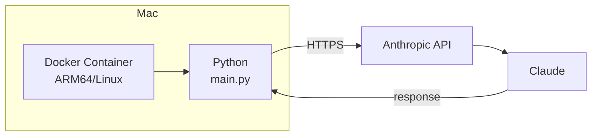
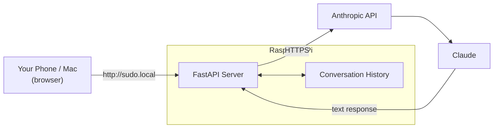
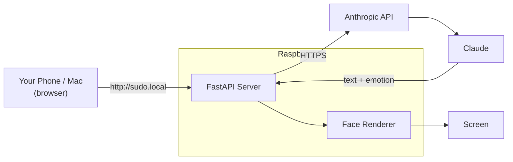
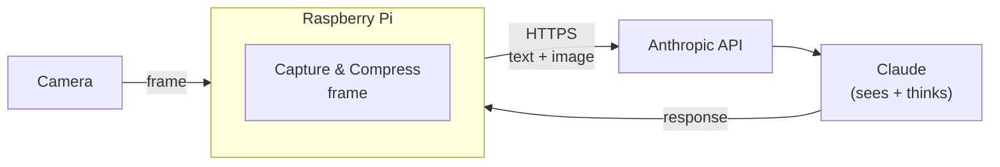
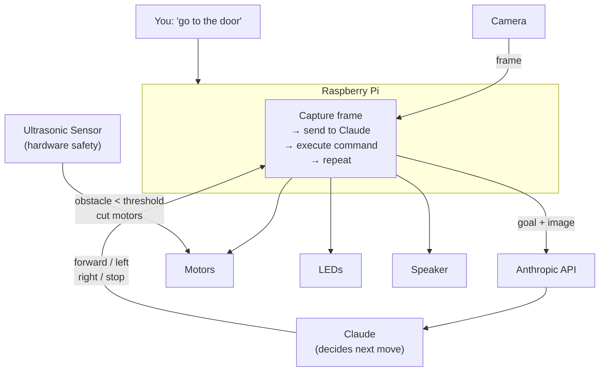

# Sudo — Architecture

## Phase 1: Foundation

Docker on Mac proves the setup works before the Pi arrives.

## Phase 2: Chat

Pi runs a web server. You chat with Sudo from a browser.

Remote access outside home network: TBD

## Phase 3: Face

Claude decides Sudo's emotion, rendered on screen.

## Phase 4: Vision

Camera frames are sent to Claude. Claude can now see.

## Phase 5: Autonomy

You give Sudo a goal. Claude navigates using the camera.

---

The Pi is the hub — everything physical connects to it, and it talks to Claude over the internet.
Claude never touches the hardware directly; it sends back instructions that Python executes locally.
